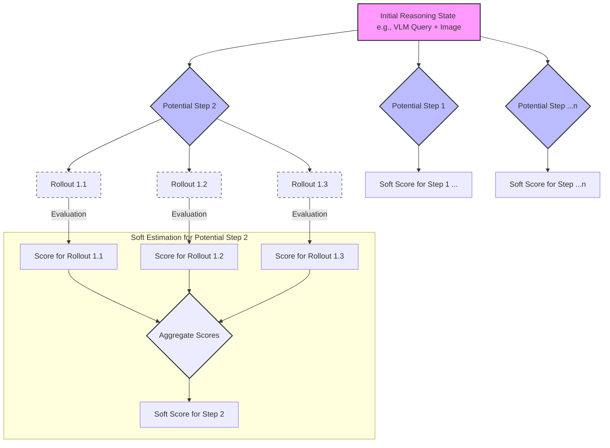
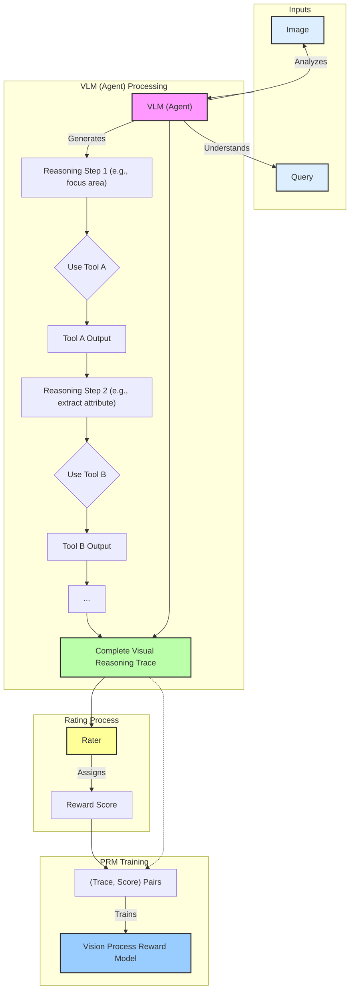

---
# You can also start simply with 'default'
theme: seriph
# random image from a curated Unsplash collection by Anthony
# like them? see https://unsplash.com/collections/94734566/slidev
background: https://cover.sli.dev
# some information about your slides (markdown enabled)
title: "Multimodal Reasoning & RLHF: Training a Process Reward Model"
info: |
  A presentation on training a Process Reward Model using an agentic approach
  to verify the validity of reasoning generated by a Vision Language Model.

  Learn more at [Sli.dev](https://sli.dev)
# apply unocss classes to the current slide
class: text-center
# https://sli.dev/features/drawing
drawings:
  persist: false
# slide transition: https://sli.dev/guide/animations.html#slide-transitions
transition: slide-left
# enable MDC Syntax: https://sli.dev/features/mdc
mdc: true
# open graph
# seoMeta:
#  ogImage: https://cover.sli.dev
---

# Multimodal Reasoning & RLHF

### Training a Process Reward Model for VLM Reasoning Verification

<div class="pt-12">
  <span @click="$slidev.nav.next" class="px-2 py-1 rounded cursor-pointer" hover="bg-white bg-opacity-10">
    Press Space for next page <carbon:arrow-right class="inline"/>
  </span>
</div>

<div class="abs-br m-6 text-xl">
  <button @click="$slidev.nav.openInEditor()" title="Open in Editor" class="slidev-icon-btn">
    <carbon:edit />
  </button>
  <a href="https://github.com/slidevjs/slidev" target="_blank" class="slidev-icon-btn">
    <carbon:logo-github />
  </a>
</div>

<!--
The last comment block of each slide will be treated as slide notes. It will be visible and editable in Presenter Mode along with the slide. [Read more in the docs](https://sli.dev/guide/syntax.html#notes)
-->

---
layout: default
class: text-sm
---

# Outline

1.  **Introduction: The Challenge of VLM Reasoning**
    - What are VLMs?
    - Why is verifying their reasoning hard?
2.  **Background: The Rise of Multimodal Reasoning**
    - Industry Emergence
    - Enterprise Applications
    - Our Research Focus
3.  **Our Approach: Process Reward Models (PRM)**
    - What is a PRM?
    - Agentic Verification
4.  **Core Mechanism 1: Monte Carlo Rollouts for "Soft Estimation"**
    - *Image: Monte Carlo Rollout Sampling* (Placeholder)
    - Explanation of the process
5.  **Core Mechanism 2: Generating Rewards for Perception**
    - *Image: Perception Reward Generation* (Placeholder)
    - How human feedback (or other oracles) train the Vision PRM
6.  **RLHF for Fine-tuning the VLM**
    - Closing the loop: Using the PRM for RLHF
7.  **Expected Impact & Future Work**
8.  **Q&A**

---
layout: default
---

# 1. Introduction: The Challenge of VLM Reasoning

## What are Vision Language Models (VLMs)?

-   Models that understand and generate information across both visual and textual modalities.
-   Examples: Image captioning, Visual Question Answering (VQA), multimodal dialogue.
-   Show great promise, but...

## Why is verifying their reasoning hard?

-   **Black Box Nature**: Internal decision-making processes are often opaque.
-   **Multimodal Complexity**: Reasoning can span and integrate information from images and text in intricate ways.
    -   *Is the model "seeing" the right thing?*
    -   *Is it "understanding" the question correctly in context of the image?*
-   **Subjectivity & Ambiguity**: Correctness can be nuanced, especially for complex scenes or abstract questions.
-   **Scalability of Human Evaluation**: Exhaustively verifying every step of a VLM's reasoning chain is time-consuming and expensive.

We need a more scalable and reliable way to ensure VLMs are reasoning correctly, not just getting the right final answer (potentially for the wrong reasons).

---
layout: default
---

# Background: The Rise of Multimodal Reasoning

## Industry Emergence

- **Multimodal reasoning** powers cutting-edge products like:
  - OpenAI Operator
  - Manus
  - ChatGPT's o3 agentic capabilities
- These systems can zoom into images, search the web, and use code interpreters to answer complex multimodal queries
- Represents a significant leap beyond unimodal AI systems

---
layout: default
---

# Background: Enterprise Applications

## The Shift to Agentic Document Synthesis

- AI is now automating **highly skilled analyst jobs** previously done manually
- **Example**: Geospatial image analysis in defense 
  - Traditionally labor-intensive and expertise-dependent
  - Now being augmented or replaced by AI systems
- Enormous potential for productivity gains and novel insights
- But requires robust, verifiable reasoning capabilities

---
layout: default
---

# Background: Our Research Focus

## Self-Play Reinforcement Learning for Reasoning

- We focus on **"self-play" reinforcement learning (RL)** techniques
- Goal: Enhance multimodal reasoning with **minimal human annotation**
- Our approach:
  - Automated "semi-formal" verification methods
  - Inspired by formal verification in mathematics and code
  - Creates a scalable path to more robust multimodal reasoning

- The key innovation: Using **Process Reward Models** to verify reasoning chains

---
layout: default
---

# 2. Our Approach: Process Reward Models (PRM)

## What is a Process Reward Model?

-   Instead of rewarding steps based only on the final output (outcome-based reward), a PRM evaluates the **intermediate steps** or the **reasoning process** itself.
-   This provides a more granular and informative feedback signal.
-   **Goal**: To train a model that can predict how good a particular reasoning step (or a sequence of steps) is.

## Agentic Verification

-   We propose an **agentic approach** to build and utilize this PRM.
-   The "agent" (which could be the VLM itself, or a dedicated verification model) generates reasoning steps.
-   The PRM (or human annotators initially, to train the PRM) provides feedback on these steps.
-   This allows for iterative refinement and learning of valid reasoning pathways.

**Focus**: Training a **Vision Process Reward Model (V-PRM)** specifically for the perception and reasoning components of a VLM.

---
layout: default
---

# 3. Core Mechanism 1: Monte Carlo Rollouts for "Soft Estimation"


**Figure 1: Illustrative Monte Carlo Rollout Sampling for Soft Estimation**

## Explanation:

-   **Challenge**: Directly evaluating every possible reasoning path is intractable.
-   **Monte Carlo Tree Search (MCTS)-inspired approach**: We use rollouts (simulations) to estimate the "value" or "correctness" of intermediate reasoning states.
-   **"Soft Estimation"**:
    -   The VLM generates potential next steps or substeps in its reasoning.
    -   For each step, multiple "rollouts" (continuations) are sampled.
    -   These rollouts are evaluated (e.g., by a simpler model, heuristics, or eventually the PRM itself) to get an estimated future reward.
    -   This provides a "soft" score for each intermediate step, guiding the VLM towards more promising reasoning paths.
-   This mechanism helps in exploring the reasoning space and identifying high-quality intermediate steps without exhaustive search.

---
layout: default
---

# 4. Core Mechanism 2: Generating Rewards for Perception


**Figure 2: Generating Reward Scores for Vision Process Reward Model Training (Illustrative)**

## How we generate reward scores for the V-PRM:

-   **Focus**: Specifically on the visual perception and grounding aspects of the VLM's reasoning.
    -   *Did the VLM correctly identify relevant objects?*
    -   *Did it accurately interpret spatial relationships pertinent to the query?*
    -   *Were the visual features attended to appropriate for the reasoning step?*
-   **Human-in-the-loop / Oracle**:
    -   Initially, human annotators (or a more powerful oracle model) provide scores for individual perception-action steps generated by the VLM.
    -   Example: Given an image and a query like "What is the red object to the left of the blue cube?", a reasoning step might involve:
        1.  `Agent`: "I see a red sphere." (Focus on red sphere) -> `Human/Oracle Score`: +1 (correct identification)
        2.  `Agent`: "It is to the left of a blue cube." (Focus on blue cube and relative position) -> `Human/Oracle Score`: +1 (correct spatial reasoning)
-   These scored (perception step, reward) pairs become the training data for the **Vision Process Reward Model (V-PRM)**.
-   The V-PRM learns to predict these reward scores for unseen perception steps.

---
layout: default
---

# 5. RLHF for Fine-tuning the VLM

## Closing the Loop:

1.  **VLM Generates Reasoning**: The primary VLM generates a sequence of reasoning steps (including perception actions) to answer a query about an image.
    ```
    VLM: [Step 1] -> [Step 2] -> ... -> [Final Answer]
    ```

2.  **V-PRM Scores the Process**: Our trained Vision Process Reward Model (V-PRM) evaluates each step (or the entire chain), focusing on the validity of the visual processing.
    ```
    V-PRM: Score([Step 1]), Score([Step 2]), ...
    ```

3.  **Reinforcement Learning from Human Feedback (RLHF)**:
    -   The scores from the V-PRM act as the reward signal.
    -   This reward signal is used to fine-tune the original VLM using reinforcement learning algorithms (e.g., PPO).
    -   The VLM learns to produce reasoning chains that receive higher scores from the V-PRM, thereby improving the correctness and verifiability of its reasoning.

**Benefit**: Moves beyond simple answer accuracy to ensure the *way* the VLM arrives at the answer is sound, particularly its visual understanding.

---
layout: default
---

# 6. Expected Impact & Future Work

## Expected Impact:

-   **More Trustworthy VLMs**: By focusing on the reasoning process, we can build VLMs that are not just accurate but also demonstrably reason correctly.
-   **Improved Debuggability**: If a VLM fails, the PRM can help pinpoint *where* in the reasoning process the error occurred.
-   **Better Sample Efficiency for RLHF**: Process-based rewards can be more informative than sparse outcome-based rewards, potentially leading to faster learning.
-   **Scalable Oversight**: A well-trained PRM can automate much of the verification process, reducing reliance on expensive human annotation.

## Future Work:

-   Extending PRMs to more complex, multi-step reasoning tasks.
-   Investigating different agentic architectures for verification.
-   Combining process rewards with outcome rewards for a more holistic signal.
-   Developing methods for the PRM to provide *explanatory* feedback, not just scores.
-   Exploring the V-PRM's capability to generalize to new tasks and domains.

---
layout: center
class: "text-xl"
---

# Questions?

Feel free to ask anything!

You can find the project/code (if applicable) at:
`[Link to your repo/project page]`

Contact: `[Your Name/Email]`

Thank you!
