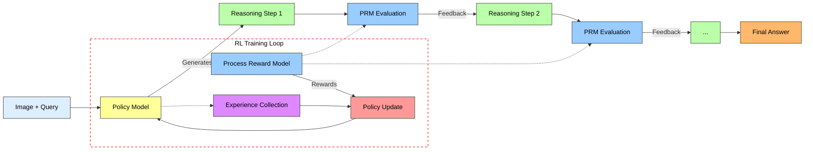

---
# You can also start simply with 'default'
theme: seriph
# random image from a curated Unsplash collection by Anthony
# like them? see https://unsplash.com/collections/94734566/slidev
background: https://cover.sli.dev
# some information about your slides (markdown enabled)
title: "Multimodal Reasoning & RLHF: Training a Process Reward Model"
info: |
  A presentation on training a Process Reward Model using an agentic approach
  to verify the validity of reasoning generated by a Vision Language Model.

  Learn more at [Sli.dev](https://sli.dev)
# apply unocss classes to the current slide
class: text-center
# https://sli.dev/features/drawing
drawings:
  persist: false
# slide transition: https://sli.dev/guide/animations.html#slide-transitions
transition: slide-left
# enable MDC Syntax: https://sli.dev/features/mdc
mdc: true
# open graph
# seoMeta:
#  ogImage: https://cover.sli.dev
# add scripts for Twitter widget
headersFrontmatter:
  scripts:
    - src: https://platform.twitter.com/widgets.js
      async: true
---

# Multimodal Reasoning & RL

### "Age of Experience", Test-time Scaling, Self-Improving Agents, PRMs

<div class="abs-br m-6 text-xl">
  <button @click="$slidev.nav.openInEditor()" title="Open in Editor" class="slidev-icon-btn">
    <carbon:edit />
  </button>
  <!-- <a href="https://github.com/slidevjs/slidev" target="_blank" class="slidev-icon-btn">
    <carbon:logo-github />
  </a> -->
</div>

<!--
The last comment block of each slide will be treated as slide notes. It will be visible and editable in Presenter Mode along with the slide. [Read more in the docs](https://sli.dev/guide/syntax.html#notes)
-->

---
layout: default
---

# Outline

1.  **Background: The Rise of Multimodal Reasoning**
    - Frontier AI products (Operator, Manus)
    - Enterprise Applications
2.  **The Age of Experience: Self-Improving Agents with RL and PRMs**
    - Improving agents with experience without human annotation
    - Agentic Verification
3.  **Core Mechanism 1: Monte Carlo Rollouts**
    - Generating experiences
4.  **Core Mechanism 2: Agentic Verification of Reasoning Traces**
    - Verifying reasoning traces using specialized agents with tools
5.  **Using PRM to Improve Policy Model with RL**
    - Use the newly trained PRM to improve multimodal reasoning

---
layout: default
---

# Background: The Rise of Multimodal Reasoning

## Industry Emergence

- **Multimodal reasoning** powers cutting-edge products like:
  - OpenAI Operator
  - Manus
  - ChatGPT's o3 agentic capabilities
- These systems can zoom into images, search the web, and use code interpreters to answer complex multimodal queries
- Represents a significant leap beyond unimodal AI systems

---
layout: center
---

<Tweet id="1912954344724406475" user="minchoi" />

---
layout: default
class: text-small
---

```
<Question>
Where is this location in the image?
[Image: Street view of a city intersection]
</Question>

<crop_tool>
I'll analyze specific parts of this image to identify the location.
[Crop: Street sign visible in upper right]
</crop_tool>

<reasoning>
I can see "8th Ave" on the green street sign. There appears to be text about a "safety walkway." I should also examine other identifying features. The building architecture might provide additional clues.
[Crop: Building with distinctive vertical panels]
The building appears to have a modern design with vertical panels. This could be "220 West 58th" based on the architectural style.
</reasoning>

<web_search_tool>
Searching: "8th Ave intersection near West 58th Street New York"
</web_search_tool>

<reasoning>
The search results confirm this is likely in Manhattan, New York City. The intersection of 8th Avenue and West 58th Street is in Midtown, near Columbus Circle. The architectural style of the building matches buildings in this area. I can now provide a specific answer with high confidence.
</reasoning>

<final_answer>
This location is the intersection of 8th Avenue and West 58th Street in Midtown Manhattan, New York City (coordinates approximately 40.7664째 N, 73.9815째 W). The image shows the northwest corner of this intersection, looking north up 8th Avenue.
</final_answer>
```

---
layout: default
---

# Background: Enterprise Applications

## The Shift to Agentic Document Synthesis

- Companies are trying to automate **highly skilled jobs** that require visual human judgement
- **Example**: Geospatial image analysis in defense 
  - Traditionally labor-intensive and expertise-dependent
- Agentic reasoning systems enable workflow automation involving visual judgement
- Requires robust, verifiable reasoning capabilities

---
layout: center
---

<iframe width="760" height="515" src="https://www.youtube.com/embed/dHc6tDcE8wk?start=45" title="YouTube video player" frameborder="0" allow="accelerometer; autoplay; clipboard-write; encrypted-media; gyroscope; picture-in-picture" allowfullscreen></iframe>

---
layout: default
---

# Background: Our Research Focus

## Self-Play Reinforcement Learning for Reasoning

- We focus on **"self-play" reinforcement learning (RL)** techniques
- Goal: Enhance multimodal reasoning with **minimal human annotation**
- Our approach:
  - Automated "semi-formal" verification methods
  - Creates a scalable path to improve multimodal reasoning

- The key innovation: Using **Generative Agents** to verify reasoning chains

---
layout: default
---

# Core Mechanism 1: Monte Carlo Rollouts


---
layout: default
class: text-small
---

```
<Question>
Where is this location in the image?
[Image: Street view of a city intersection]
</Question>

<crop_tool>
I'll analyze specific parts of this image to identify the location.
[Crop: Street sign visible in upper right]
</crop_tool>

<reasoning>
I can see "8th Ave" on the green street sign. There appears to be text about a "safety walkway." I should also examine other identifying features. The building architecture might provide additional clues.
[Crop: Building with distinctive vertical panels]
The building appears to have a modern design with vertical panels. This could be "220 West 58th" based on the architectural style.
</reasoning>

<web_search_tool>
Searching: "8th Ave intersection near West 58th Street New York"
</web_search_tool>

<reasoning>
The search results confirm this is likely in Manhattan, New York City. The intersection of 8th Avenue and West 58th Street is in Midtown, near Columbus Circle. The architectural style of the building matches buildings in this area. I can now provide a specific answer with high confidence.
</reasoning>

<final_answer>
This location is the intersection of 8th Avenue and West 58th Street in Midtown Manhattan, New York City (coordinates approximately 40.7664째 N, 73.9815째 W). The image shows the northwest corner of this intersection, looking north up 8th Avenue.
</final_answer>
```

---
layout: default
---

# Core Mechanism 2: Train a Process Reward Model with Agentic Verification of Reasoning Traces


---
layout: default
class: text-small
---

### Agentic Verification Example

```
<reasoning_trace>
I'll analyze specific parts of this image to identify the location.
[Crop: Street sign visible in upper right]
</reasoning_trace>

<verify>
I need to verify if this reasoning trace is valid. I'll use image analysis and web search tools to check the claims.

<image_analysis_tool>
Analyzing the cropped regions:
- Confirmed: Green street sign shows "8th Ave"
- Confirmed: Building has distinctive vertical panels
</image_analysis_tool>

<web_search_tool>
Search: "8th Avenue West 58th Street Manhattan building with vertical panels"
Results: Found images of this intersection matching the building description. The northwest corner has a modern building with vertical panels.
</web_search_tool>

<reasoning_verification>
The agent correctly identified the street sign and architectural features. The claim about "220 West 58th" is partially accurate - there is a building at that intersection, though the exact address should be verified. The final conclusion about the intersection location is supported by the evidence.
</reasoning_verification>

<final_judgement>
Judgment: Yes, the reasoning trace is valid.
</final_judgement>
</verify>
```

---
layout: default
---

# RL to Improve Policy Model, and Using PRM at Test-Time



## Value Add of PRMs

- PRM provides **real-time feedback** during inference
- Guides the policy model to generate **high-quality reasoning traces**
- Enables **test-time scaling** without additional training
- Results in more **reliable and interpretable** multimodal reasoning
- **RL training loop** uses PRM rewards to continuously improve policy model
